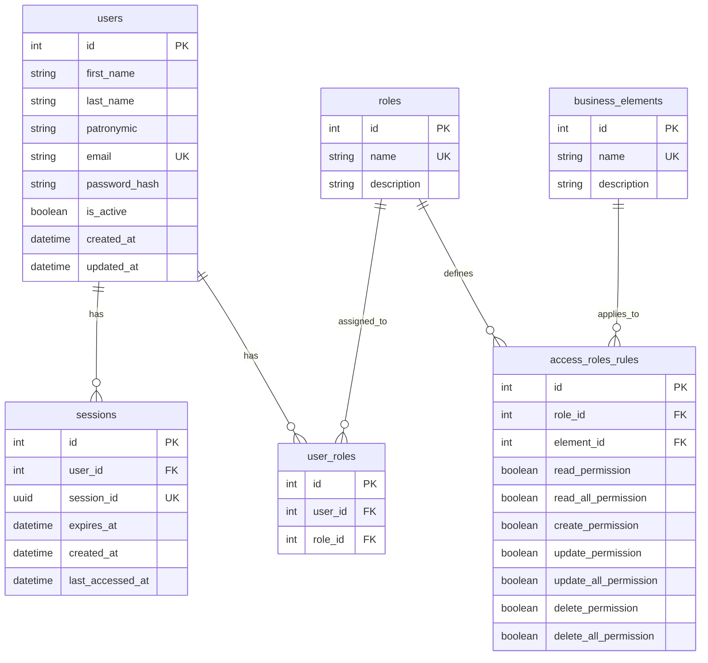
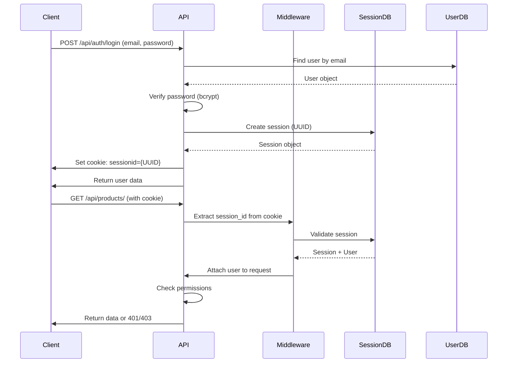
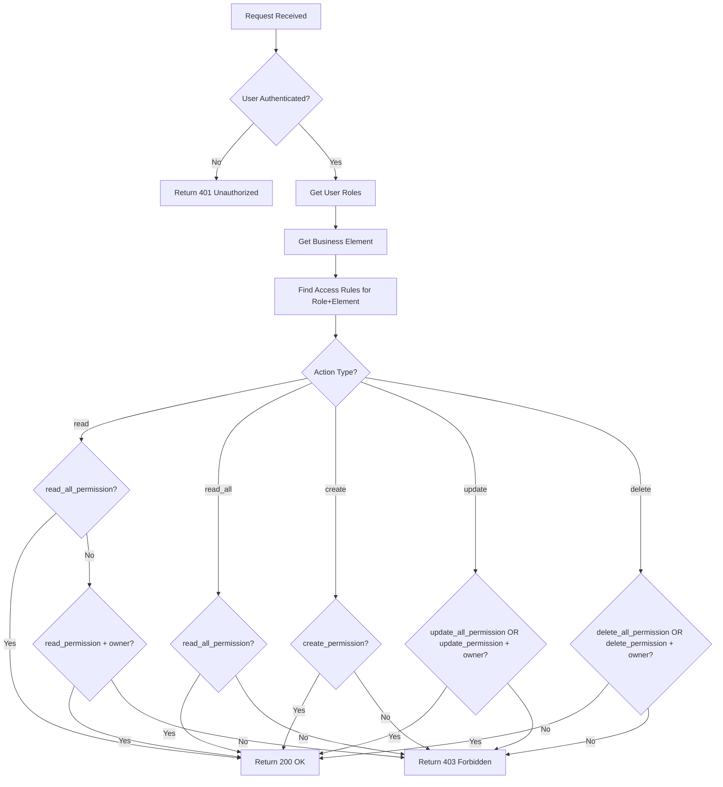

# Custom Authentication and Authorization System

A custom authentication and authorization system built with Django REST Framework and PostgreSQL, implementing session-based authentication and role-based access control (RBAC).

## Table of Contents

- [Architecture Overview](#architecture-overview)
- [Database Schema](#database-schema)
- [Authentication System](#authentication-system)
- [Authorization System](#authorization-system)
- [API Endpoints](#api-endpoints)
- [Installation and Setup](#installation-and-setup)
- [Usage Examples](#usage-examples)

## Architecture Overview

This system implements a custom authentication and authorization framework that is independent from Django's built-in `django.contrib.auth`. The system consists of:

1. **Custom User Model**: Stores user information with bcrypt password hashing
2. **Session Management**: Custom session table with UUID-based session IDs stored in cookies
3. **Role-Based Access Control**: Roles, business elements, and permission rules
4. **RESTful API**: Django REST Framework endpoints for all operations

### Key Components

- **SessionMiddleware**: Custom middleware that validates sessions and attaches users to requests
- **HasElementPermission**: Permission class that checks user roles against business element permissions
- **Mock Business Objects**: Example endpoints demonstrating access control in action

## Database Schema

### Entity Relationship Diagram



### Tables Description

#### 1. users
Stores user account information.
- **id**: Primary key
- **first_name**, **last_name**, **patronymic**: User's name
- **email**: Unique email address (used for login)
- **password_hash**: Bcrypt-hashed password
- **is_active**: Boolean flag for soft delete (False = deleted)
- **created_at**, **updated_at**: Timestamps

#### 2. sessions
Manages user sessions for authentication.
- **id**: Primary key
- **user_id**: Foreign key to users
- **session_id**: Unique UUID (stored in cookie)
- **expires_at**: Session expiration timestamp (7 days from creation)
- **created_at**: Session creation time
- **last_accessed_at**: Last access time (updated on each request)

#### 3. roles
Defines user roles in the system.
- **id**: Primary key
- **name**: Unique role name (admin, manager, user, guest)
- **description**: Role description

#### 4. user_roles
Many-to-many relationship between users and roles.
- **id**: Primary key
- **user_id**: Foreign key to users
- **role_id**: Foreign key to roles
- Unique constraint on (user_id, role_id)

#### 5. business_elements
Defines business entities that require access control.
- **id**: Primary key
- **name**: Unique element name (users, products, shops, orders, access_rules)
- **description**: Element description

#### 6. access_roles_rules
Defines permissions for each role on each business element.
- **id**: Primary key
- **role_id**: Foreign key to roles
- **element_id**: Foreign key to business_elements
- **read_permission**: Can read own objects
- **read_all_permission**: Can read all objects
- **create_permission**: Can create objects
- **update_permission**: Can update own objects
- **update_all_permission**: Can update all objects
- **delete_permission**: Can delete own objects
- **delete_all_permission**: Can delete all objects
- Unique constraint on (role_id, element_id)

## Authentication System

### Authentication Flow



### Password Security

- Passwords are hashed using **bcrypt** with cost factor 12
- Passwords are never stored in plain text
- Password verification uses constant-time comparison

### Session Management

- Sessions use **UUID v4** as session identifiers
- Sessions expire after **7 days** of inactivity
- Session IDs are stored in **HttpOnly cookies** (prevents XSS)
- Cookies use **SameSite=Lax** (CSRF protection)
- Expired sessions are automatically cleaned up

### Registration

1. User provides: first_name, last_name, patronymic, email, password, password_confirmation
2. System validates email uniqueness and password match
3. Password is hashed with bcrypt
4. User is created with `is_active=True`
5. User data is returned (without password)

### Login

1. User provides: email, password
2. System finds user by email
3. System verifies password with bcrypt
4. System checks if user is active (`is_active=True`)
5. System creates new session with UUID
6. System sets cookie with session_id
7. User data is returned

### Logout

1. System extracts session_id from cookie
2. System deletes session record
3. System clears session cookie
4. Success response is returned

### Account Deletion (Soft Delete)

1. User must be authenticated
2. System sets `user.is_active = False`
3. System deletes all user sessions
4. System logs out user (clears cookie)
5. User can no longer log in
6. Record remains in database

## Authorization System

### Permission Model

The authorization system uses a **Role-Based Access Control (RBAC)** model with the following components:

1. **Roles**: Define user categories (admin, manager, user, guest)
2. **Business Elements**: Define resources that need protection (users, products, shops, orders, access_rules)
3. **Access Rules**: Define what each role can do with each element

### Permission Types

Each access rule defines seven permission flags:

- **read_permission**: User can read objects they own
- **read_all_permission**: User can read all objects
- **create_permission**: User can create new objects
- **update_permission**: User can update objects they own
- **update_all_permission**: User can update all objects
- **delete_permission**: User can delete objects they own
- **delete_all_permission**: User can delete all objects

### Permission Checking Logic



### Default Roles and Permissions

#### Admin Role
- Full access to all business elements
- All permissions enabled (read_all, create, update_all, delete_all)
- Can manage access rules via Admin API

#### Manager Role
- Read and create access to products, shops, orders
- Can update all objects but cannot delete
- No access to users or access_rules

#### User Role
- Can read, create, update, and delete own objects
- Cannot access objects owned by others
- No access to users or access_rules

#### Guest Role
- Read-only access to products, shops, orders (own objects only)
- Cannot create, update, or delete
- No access to users or access_rules

## API Endpoints

### Authentication Endpoints

#### Register User
```
POST /api/auth/register/
Content-Type: application/json

{
  "first_name": "John",
  "last_name": "Doe",
  "patronymic": "Smith",
  "email": "john@example.com",
  "password": "securepassword123",
  "password_confirmation": "securepassword123"
}

Response: 201 Created
{
  "id": 1,
  "first_name": "John",
  "last_name": "Doe",
  "patronymic": "Smith",
  "email": "john@example.com",
  "is_active": true,
  "created_at": "2024-01-01T00:00:00Z",
  "updated_at": "2024-01-01T00:00:00Z"
}
```

#### Login
```
POST /api/auth/login/
Content-Type: application/json

{
  "email": "john@example.com",
  "password": "securepassword123"
}

Response: 200 OK
Set-Cookie: sessionid={uuid}; HttpOnly; SameSite=Lax
{
  "id": 1,
  "first_name": "John",
  "last_name": "Doe",
  "patronymic": "Smith",
  "email": "john@example.com",
  "is_active": true,
  "created_at": "2024-01-01T00:00:00Z",
  "updated_at": "2024-01-01T00:00:00Z"
}
```

#### Logout
```
POST /api/auth/logout/
Cookie: sessionid={uuid}

Response: 200 OK
{
  "message": "Logged out successfully"
}
```

#### Get Profile
```
GET /api/auth/profile/
Cookie: sessionid={uuid}

Response: 200 OK
{
  "id": 1,
  "first_name": "John",
  "last_name": "Doe",
  "patronymic": "Smith",
  "email": "john@example.com",
  "is_active": true,
  "created_at": "2024-01-01T00:00:00Z",
  "updated_at": "2024-01-01T00:00:00Z"
}
```

#### Update Profile
```
PATCH /api/auth/profile/
Cookie: sessionid={uuid}
Content-Type: application/json

{
  "first_name": "Jane",
  "last_name": "Smith"
}

Response: 200 OK
{
  "id": 1,
  "first_name": "Jane",
  "last_name": "Smith",
  "patronymic": "Smith",
  "email": "john@example.com",
  "is_active": true,
  "created_at": "2024-01-01T00:00:00Z",
  "updated_at": "2024-01-01T00:01:00Z"
}
```

#### Delete Account
```
DELETE /api/auth/account/
Cookie: sessionid={uuid}

Response: 200 OK
{
  "message": "Account deleted successfully"
}
```

### Mock Business Object Endpoints

#### Get Products
```
GET /api/products/
Cookie: sessionid={uuid}

Response: 200 OK
{
  "products": [
    {
      "id": 1,
      "name": "Laptop",
      "price": 999.99,
      "owner_id": 1,
      "description": "High-performance laptop"
    }
  ]
}

Error: 401 Unauthorized (if not authenticated)
Error: 403 Forbidden (if no read permission)
```

#### Get Shops
```
GET /api/shops/
Cookie: sessionid={uuid}

Response: 200 OK
{
  "shops": [...]
}
```

#### Get Orders
```
GET /api/orders/
Cookie: sessionid={uuid}

Response: 200 OK
{
  "orders": [...]
}
```

### Admin API Endpoints

#### List Access Rules
```
GET /api/admin/access-rules/
Cookie: sessionid={uuid} (admin role required)

Response: 200 OK
{
  "results": [
    {
      "id": 1,
      "role": 1,
      "role_name": "admin",
      "element": 2,
      "element_name": "products",
      "read_permission": true,
      "read_all_permission": true,
      "create_permission": true,
      "update_permission": true,
      "update_all_permission": true,
      "delete_permission": true,
      "delete_all_permission": true
    }
  ]
}
```

#### Create Access Rule
```
POST /api/admin/access-rules/
Cookie: sessionid={uuid} (admin role required)
Content-Type: application/json

{
  "role": 3,
  "element": 2,
  "read_permission": true,
  "read_all_permission": false,
  "create_permission": true,
  "update_permission": true,
  "update_all_permission": false,
  "delete_permission": true,
  "delete_all_permission": false
}

Response: 201 Created
{
  "id": 15,
  ...
}
```

#### Update Access Rule
```
PATCH /api/admin/access-rules/{id}/
Cookie: sessionid={uuid} (admin role required)
Content-Type: application/json

{
  "read_all_permission": true
}

Response: 200 OK
{
  "id": 15,
  ...
}
```

#### Delete Access Rule
```
DELETE /api/admin/access-rules/{id}/
Cookie: sessionid={uuid} (admin role required)

Response: 200 OK
{
  "message": "Access rule deleted successfully"
}
```

## Installation and Setup

### Prerequisites

- Python 3.8+
- PostgreSQL 12+
- pip

### Step 1: Clone and Setup Virtual Environment

```bash
cd custom-auth
python3 -m venv venv
source venv/bin/activate  # On Windows: venv\Scripts\activate
pip install -r requirements.txt
```

### Step 2: Configure Database

Create a PostgreSQL database:

```sql
CREATE DATABASE custom_auth_db;
CREATE USER postgres WITH PASSWORD 'postgres';
GRANT ALL PRIVILEGES ON DATABASE custom_auth_db TO postgres;
```

Update database settings in `config/settings.py` if needed:

```python
DATABASES = {
    'default': {
        'ENGINE': 'django.db.backends.postgresql',
        'NAME': 'custom_auth_db',
        'USER': 'postgres',
        'PASSWORD': 'postgres',
        'HOST': 'localhost',
        'PORT': '5432',
    }
}
```

### Step 3: Run Migrations

```bash
python manage.py makemigrations
python manage.py migrate
```

### Step 4: Load Initial Data

```bash
python manage.py loaddata fixtures/initial_data.json
```

This will create:
- 4 roles: admin, manager, user, guest
- 5 business elements: users, products, shops, orders, access_rules
- Access rules for all role-element combinations

### Step 5: Create Admin User (Optional)

You can create an admin user via Django shell:

```bash
python manage.py shell
```

```python
from auth.models import User, Role, UserRole
from auth.utils import hash_password

# Create admin user
admin_user = User.objects.create(
    first_name="Admin",
    last_name="User",
    email="admin@example.com",
    password_hash=hash_password("admin123"),
    is_active=True
)

# Assign admin role
admin_role = Role.objects.get(name="admin")
UserRole.objects.create(user=admin_user, role=admin_role)
```

### Step 6: Run Development Server

```bash
python manage.py runserver
```

The API will be available at `http://localhost:8000`

## Usage Examples

### Example 1: Register and Login

```bash
# Register
curl -X POST http://localhost:8000/api/auth/register/ \
  -H "Content-Type: application/json" \
  -d '{
    "first_name": "John",
    "last_name": "Doe",
    "email": "john@example.com",
    "password": "password123",
    "password_confirmation": "password123"
  }'

# Login (save cookie)
curl -X POST http://localhost:8000/api/auth/login/ \
  -H "Content-Type: application/json" \
  -d '{
    "email": "john@example.com",
    "password": "password123"
  }' \
  -c cookies.txt

# Access protected resource
curl http://localhost:8000/api/products/ \
  -b cookies.txt
```

### Example 2: Assign Role to User

```python
from auth.models import User, Role, UserRole

user = User.objects.get(email="john@example.com")
user_role = Role.objects.get(name="user")
UserRole.objects.create(user=user, role=user_role)
```

### Example 3: Test Permissions

```bash
# As regular user (can only see own products)
curl http://localhost:8000/api/products/ -b cookies.txt

# As admin (can see all products)
# First assign admin role, then login
curl http://localhost:8000/api/products/ -b admin_cookies.txt
```

## Security Considerations

1. **Password Hashing**: Bcrypt with cost factor 12
2. **Session Security**: HttpOnly cookies prevent XSS attacks
3. **CSRF Protection**: SameSite=Lax cookies
4. **SQL Injection**: Protected by Django ORM
5. **XSS Protection**: JSON responses, no HTML rendering
6. **Session Expiration**: Automatic cleanup of expired sessions

## Error Responses

### 401 Unauthorized
```json
{
  "error": "Authentication required"
}
```

### 403 Forbidden
```json
{
  "detail": "Permission denied for action \"read\" on \"products\""
}
```

### 400 Bad Request
```json
{
  "email": ["Email already registered"],
  "password": ["Passwords do not match"]
}
```

## Testing the System

1. **Register a new user**
2. **Login and receive session cookie**
3. **Access mock business objects** (products, shops, orders)
4. **Assign roles** to users via Django shell
5. **Test permissions** by accessing resources with different roles
6. **Use Admin API** to modify access rules (requires admin role)

## Architecture Decisions

1. **Custom User Model**: Independent from Django's auth system for full control
2. **Session-based Auth**: Simpler than JWT for this use case, easier to revoke
3. **RBAC Model**: Flexible permission system that can be extended
4. **Soft Delete**: Preserves data integrity while allowing account deletion
5. **Permission Flags**: Granular control over read/update/delete operations

## Future Enhancements

- JWT token support as alternative to sessions
- Permission caching for better performance
- Audit logging for access control events
- Multi-factor authentication support
- Rate limiting for API endpoints
